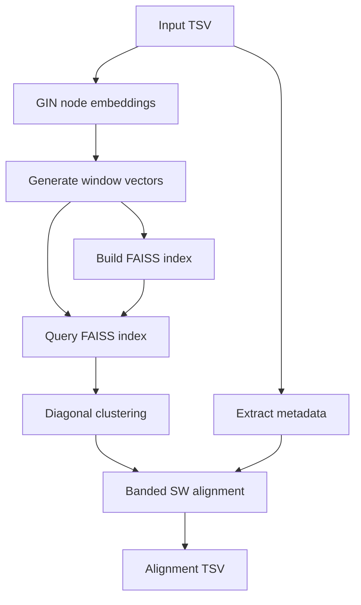

# GINflow 🧬

GINflow is a Nextflow pipeline for BLAST-style search over RNA secondary structures. It combines [GINFINITY](https://github.com/nicoaira/GINFINITY) node embeddings with FAISS-based seeding and banded Smith–Waterman alignments to discover high-scoring local matches between query and database transcripts.

## Overview

1. **Node embeddings** – run `ginfinity-generate-node-embeddings` on the full transcript table (CPU or GPU).
2. **Window vectors** – slide a configurable window across each transcript, concatenate node embeddings, and L2-normalise the resulting vectors.
3. **Index build** – load all database windows into a FAISS index (Flat, IVF, IVFPQ, OPQ+IVFPQ, HNSW, or HNSWSQ8).
4. **Seeding** – query each window from the designated query set, retain neighbours above a cosine threshold, and record their implied diagonals.
5. **Diagonal clustering** – enforce a two-hit rule by grouping seeds that fall within a user-defined span while permitting limited diagonal drift.
6. **Local alignment** – inflate each cluster into a candidate region and run a banded Smith–Waterman alignment that adapts to the observed diagonal spread. Scores are derived from z-scored cosine similarities using background μ/σ estimates.
7. **Reporting** – emit a TSV of the top scoring high-scoring pairs (HSPs) with coordinates, scores, average cosine similarity, gaps, and sequence/structure snippets.

## Key Features

- **BLAST-like workflow** tailored to structure-aware node embeddings.
- **Configurable FAISS backends** with support for Flat, IVF, IVFPQ, OPQ+IVFPQ, HNSW, and HNSWSQ8 indices.
- **Deterministic seeding** via cosine similarity thresholds and drift-aware diagonal clustering.
- **Banded Smith–Waterman** with affine gaps, X-drop termination, and user-tunable scoring clamps.
- **Background-aware scoring** using μ/σ derived from random node pairs.
- **GPU-ready embeddings**through ginfinity profiles, while downstream steps run efficiently on CPUs.
- **Single TSV output** that captures the top alignments alongside sequence/structure context for downstream analysis or custom reporting.

## Pipeline Workflow



### Step-by-Step

1. **Prepare inputs** – a single TSV/CSV containing query and database transcripts plus a separate CSV/TSV listing query IDs (`--queries`).
2. **Generate node embeddings** – ginfinity runs over `split_size` batches (via `splitCsv`) so embedding jobs parallelise cleanly; add `-profile gpu` or `--use_gpu true` to enable CUDA.
3. **Window vectorisation** – sliding windows (`--window_size`, `--window_stride`) produce normalised vectors and metadata for both query and database sets.
4. **FAISS index** – configurable via `--index_type`, `--faiss_metric`, `--faiss_nlist`, etc. Indices and metadata are cached under `outdir/faiss_index/`. For HNSW/HNSWSQ8 backends, use `--faiss_hnsw_m`, `--faiss_hnsw_efc`, and `--faiss_hnsw_efs` to balance accuracy vs. speed.
5. **Seeding** – nearest neighbours are fetched for each query window (`--faiss_k`) and filtered by `--seed_similarity_threshold` to minimise noise.
6. **Clustering** – seeds are grouped when ≥2 occur within `--cluster_span` nt and their diagonals remain within the configured tolerance (`--cluster_diagonal_tolerance`, `--cluster_max_diagonal_span`).
7. **Alignment** – each cluster is expanded with `--alignment_padding`, scored with γ-scaled cosine similarities, and aligned with a band that adapts to the diagonal spread (`--band_width`, `--band_buffer`, `--band_max_width`) plus affine gaps (`--gap_open`, `--gap_extend`) and X-drop `--xdrop`. The TSV now includes explicit gapped alignment strings alongside DP traces for downstream inspection.
8. **Output** – the `alignments.tsv` file (also copied to `outdir/`) lists the top `--top_n` HSPs sorted by score, including coordinates, average cosine similarity, gap stats, and extracted sequence/structure regions.

## Installation & Quick Start

### Prerequisites

- **Nextflow** ≥ 22.10
- **Container engine**: Docker, Singularity, or Conda (for ginfinity + FAISS dependencies)
- **Optional GPU**: recommended for large embedding jobs (activates via `-profile gpu`)

### Clone & Smoke Test

```bash
git clone https://github.com/nicoaira/GINflow.git
cd GINflow
nextflow run main.nf -profile smoke,docker
```

### Run on Your Data

```bash
nextflow run main.nf \
  --input transcripts.tsv \
  --queries query_ids.csv \
  --outdir results \
  --window_size 11 \
  --seed_similarity_threshold 0.7 \
  -profile docker
```

GPU embedding:

```bash
nextflow run main.nf -profile docker,gpu \
  --input transcripts.tsv \
  --queries query_ids.csv
```

## Input Formats

### Transcript Table (`--input`)

| Column | Description |
|--------|-------------|
| `transcript_id` | Unique transcript identifier (customisable via `--id_column`) |
| `secondary_structure` | Dot-bracket secondary structure string |
| `sequence` (optional) | Primary sequence, used for contextual output |
| other columns | Carried forward if listed in `--keep_cols` |

The table must include a header row (`--header true`) so batches created via `splitCsv` retain column names during embedding.

### Query List (`--queries`)

CSV/TSV with at least one column named `id` (override using `--query_column` via `generate_window_vectors`). Each ID must appear in the main input table.

## Configuration Profiles

Profiles remain orthogonal and can be combined as needed:

- **`smoke`** – tiny bundled dataset for quick validation.
- **`test`** – larger bundled dataset with moderate defaults.
- **`gpu`** – toggles `params.use_gpu`/`params.faiss_use_gpu` and adds GPU run options for Docker/Singularity.
- **`docker`**, **`singularity`**, **`conda`**, **`mamba`** – software stack selection.
- **`local`**, **`slurm`**, **`monitor`** – execution environment tuning.

Example:

```bash
# GPU embeddings + FAISS on CPU using Docker
nextflow run main.nf -profile docker,gpu --input transcripts.tsv --queries query_ids.csv

# SLURM + Singularity + smoke dataset
nextflow run main.nf -profile slurm,singularity,smoke
```

## Key Parameters

| Parameter | Default | Description |
|-----------|---------|-------------|
| `--input` | _required_ | Transcript table (TSV/CSV) |
| `--queries` | _required_ | Query ID list (CSV/TSV) |
| `--outdir` | `results` | Output directory |
| `--header` | `true` | Treat input file as headered TSV/CSV |
| `--split_size` | `1024` | Rows per ginfinity embedding batch |
| `--id_column` | `transcript_id` | Identifier column in the input table |
| `--structure_column_name` | `secondary_structure` | Dot-bracket column name |
| `--sequence_column` | _auto_ | Optional explicit sequence column for reporting |
| `--node_embeddings_tsv` | `null` | Reuse existing ginfinity node embeddings |
| `--window_size` | `11` | Sliding window size (nodes) |
| `--max_unpaired_fraction` | `null` | Skip windows where the dot-bracket structure has this unpaired (`.`) fraction or higher |
| `--seed_similarity_threshold` | `0.7` | Cosine similarity cut-off for seeds |
| `--index_type` | `flat_ip` | FAISS index backend |
| `--faiss_metric` | `ip` | FAISS metric (`ip` or `l2`) |
| `--faiss_k` | `50` | Neighbours retrieved per query window |
| `--faiss_hnsw_m` / `--faiss_hnsw_efc` / `--faiss_hnsw_efs` | `32` / `200` / `auto` | HNSW connectivity, construction effort, and search breadth (default efSearch = max(2×`faiss_k`, 64)) |
| `--faiss_exact_rescore` | `auto` | When enabled (default for HNSW/HNSWSQ8), recomputes similarities with the original float32 vectors before applying the seed filter |
| `--cluster_span` | `80` | Max nt distance between neighbouring clustered seeds |
| `--cluster_diagonal_tolerance` | `12` | Extra nt allowed beyond current diagonal bounds when adding a seed |
| `--cluster_max_diagonal_span` | `96` | Max diagonal spread within a cluster (0 disables the cap) |
| `--alignment_gamma` | `1.5` | Scaling for z-scored cosine similarities |
| `--band_width` | `96` | Minimum Smith–Waterman band width |
| `--band_buffer` | `32` | Additional slack added to the observed diagonal span when adapting the band |
| `--band_max_width` | `0` | Maximum band width after adaptation (0 = unlimited) |
| `--gap_open` / `--gap_extend` | `12` / `2` | Affine gap penalties |
| `--top_n` | `50` | Alignments retained in the final TSV |

See [`nextflow.config`](nextflow.config) for additional tuning options (IVF/IVFPQ settings, padding, X-drop, background sampling, etc.).

## Outputs

- **`outdir/node_embeddings.tsv`** – ginfinity node embeddings.
- **`outdir/database_windows.*` & `outdir/query_windows.*`** – window vectors + metadata.
- **`outdir/faiss_index/`** – FAISS artefacts and stats.
- **`outdir/seeds.tsv`** – retained seed matches (for debugging or downstream analysis).
- **`outdir/clusters.tsv` & `cluster_members.tsv`** – clustered seeds with diagonal drift statistics.
- **`outdir/alignments.tsv`** – top alignments with sequences/structures, gapped alignment strings (`aligned_*` columns), and alignment metrics.
- **`outdir/alignment_dp.jsonl`** – JSON Lines file containing the DP trace for each reported alignment.
- **`outdir/alignment_pairs.txt`** – BLAST-style text dump of the aligned sequences with gap characters.
- **`outdir/reports/`** – Nextflow trace/report/timeline/dag diagnostics.

## Troubleshooting

- **Few or zero seeds** – lower `--seed_similarity_threshold`, increase `--faiss_k`, or ensure query IDs exist in the input table.
- **Alignment too short** – raise `--alignment_padding`, `--band_width`, or `--band_buffer` (and relax `--band_max_width` if capped) to allow broader extension.
- **FAISS build memory pressure** – switch to `--index_type ivfpq` with a smaller `--pq_m` or reduce window size.
- **GPU embeddings not triggering** – combine `-profile gpu` with `docker`/`singularity` so ginfinity is launched with CUDA visibility.

## License

Refer to [LICENSE](LICENSE) for terms.
