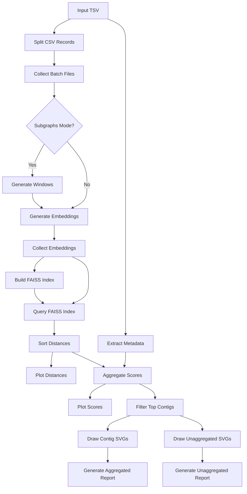

# GINflow 🧬

A Nextflow pipeline for RNA secondary structure similarity analysis using Graph Isomorphism Networks (GIN). GINflow leverages the [GINFINITY](https://github.com/nicoaira/GINFINITY) package to generate embeddings from RNA secondary structures and perform large-scale similarity searches.

## Overview

GINflow transforms RNA secondary structure data through a sophisticated bioinformatics pipeline that:

1. **Generates graph embeddings** from RNA secondary structures using pre-trained GIN models
2. **Builds FAISS indices** for efficient similarity search across large datasets
3. **Computes similarity scores** using advanced aggregation algorithms
4. **Generates interactive reports** with visualizations of the most similar RNA pairs
5. **Supports both windowed and full-sequence analysis** for different use cases

The pipeline is designed for scalability and reproducibility, supporting multiple execution environments (local, SLURM clusters) and containerization technologies (Docker, Singularity).

## Key Features

- **Graph-based RNA analysis**: Uses Graph Isomorphism Networks to capture structural features
- **Scalable similarity search**: FAISS indexing enables efficient searches across millions of sequences
- **Advanced scoring**: Multi-parameter aggregation algorithm for robust similarity quantification
- **Interactive visualization**: HTML reports with SVG structure drawings and similarity metrics
- **Flexible execution**: Supports GPU acceleration, multiple container engines, and HPC environments
- **Modular design**: 15+ independent modules that can be mixed and matched

## Pipeline Workflow



### Step-by-Step Process

1. **Input Processing**: Extract metadata and split sequences using `splitCsv` operator
2. **Batch Creation**: Use `collectFile` to create processing batches from split records
3. **Windowing** (optional): Generate sliding windows for local structure analysis
4. **Embedding Generation**: Create vector embeddings using GINFINITY's GIN model
5. **Embedding Aggregation**: Use `collectFile` to merge embedding batches into single file
6. **Similarity Search**: Build FAISS index and query for nearest neighbors
7. **Score Aggregation**: Apply sophisticated scoring algorithm with multiple parameters
8. **Visualization**: Generate SVG drawings and interactive HTML reports

## Installation & Setup

### Prerequisites

- **Nextflow** ≥ 22.10
- **Container Engine**: Docker, Singularity, or Conda
- **Hardware**: GPU optional but recommended for large datasets

### Quick Start

1. **Clone the repository**:
   ```bash
   git clone https://github.com/nicoaira/GINflow.git
   cd GINflow
   ```

2. **Test the pipeline**:
   ```bash
   nextflow run main.nf -profile test,docker
   ```

3. **Run with your data**:
   ```bash
   nextflow run main.nf \
     --input your_data.tsv \
     --queries querysheet.csv \
     --outdir results \
     -profile docker
   ```

   To make scores comparable across queries, specify `--null_shuffles <N>`.
   For each query, the sequence is shuffled preserving dinucleotides, folded
   with RNAfold, and scored against the database `N` times using the same
   query pipeline. These randomized scores form a null distribution that
   is used to emit `pairs_scores_all_contigs.normalized.tsv` with z-score,
   p-value, and q-value (Benjamini–Hochberg FDR) columns.

## Input Format

The pipeline expects a TSV file with the following required columns:

| Column | Description | Example |
|--------|-------------|---------|
| `transcript_id` | Unique identifier | `ENST00000832823.1` |
| `secondary_structure` | Dot-bracket notation | `(((...)))..((()))` |

Optional columns include genomic coordinates, sequences, and additional metadata.

## Query Sheet Format

Provide a CSV file via `--queries` containing at least one column named `id` with the identifiers to search. Each row is processed independently and its results are written under `results/queries_results/<id>/`.

### Example Input

```tsv
chr	start	end	strand	gene_id	gene_name	transcript_id	seq_len	sequence	secondary_structure
chr1	14404	24894	+	ENSG00000290825.2	DDX11L16	ENST00000832823.1	410	TTTCTGCTCAGTTCTTTATTGATTGGTGTGCCGTTTTCTCTGGAAGCCTCTTAAGAACACAGTGGCGCAGGCTGGGTGGAGCCGTCCCCCCATGGAGCACAGGCAGACAGAAGTCCCCGCCCCAGCTGTGTGGCCTCAAGCCAGCCTTCCGCTCCTTGAAGCTGGTCTCCACACAGTGCTGGTTCCGTCACCCCCTCCCAAGGAAGTAGGTCTGAGCAGCTTGTCCTGGCTGTGTCCATGTCAGAGCAACGGCCCAAGTCTGGGTCTGGGGGGGAAGGTGTCATGGAGCCCCCTACGATTCCCAGTCGTCCTCGTCCTCCTCTGCCTGTGGCTGCTGCGGTGGCGGCAGAGGAGGGATGGAGTCTGACCTGCCAGGGAGTGCTGCATCCTCACAGGAGTCATGGTGCCTG	.....((((.(((((......................................))))).................(.((......)).).....))))(...............(..........((............(.........(((((...........)...(...).).....((..((.....................(....)))))(((...)..)))...)..........................................)............(.................(........((((((((((...)...........)))).)))))))).))))...................................................
chr1	28977	31109	+	ENSG00000243485.6	MIR1302-2HG	ENST00000834618.1	468	GAGTGGGGAGGCGGAACCGGGACCCCGCAGAGCCCGGGTCCCTGCGCCCCACAAGCCTTGGCTTCCCTGCTAGGGCCGGGCAAGGCCGGGTGCAGGGCGCGGCTCCAGGGAGGAAGCTCCGGGGCGAGCCCAAGACGCCTCCCGGGCGGTCGGGGCCCAGCGGCGGCGTTCGCAGTGGAGCCGGGCACCGGGCAGCGGCCGCGGAACACCAGCTTGGCGCAGGCTTCTCGTTTTGTCCGCCTTCCCTGCCTCCTCTTCTGGGGGAGTTAGATCGAGTTGTAACAAGAACATGCCACTGTCTCGCTGGCTGCAGCGTGTGGTCCCCTTACCAGAGTGAGGATGCGAAGAGAAGGTGGCTGTCTGCAAACCAGGAAGAGAGCCCTCACCGGGAACCCGTCCAGCTGCCACCTTGAACTTGGACTTCCAAGCCTCCAGAACTGTGAGGGATAAATGTATGATTTTAAAGTC	...(......................................(.......)...(((((.....(.........(..(((....))....................).............)......))))))...((.((..........)).))...((.((.((...((...................))..)))))))...................(((..(...........(((....)..((.((......))....))........)........).........((......(............)))))(......).........(.............))................................................((........................).)...).......(....((.........))..)......
```

## Configuration Profiles

GINflow provides several orthogonal configuration profiles that can be combined:

### Execution Environments
- **`local`**: Local execution (default)
- **`slurm`**: SLURM cluster execution

### Container Engines
- **`docker`**: Docker containers (recommended)
- **`singularity`**: Singularity containers (HPC-friendly)
- **`conda`**: Conda environments

### Hardware Acceleration
- **`gpu`**: Enable GPU acceleration for embedding generation

### Testing
- **`test`**: Run with small test dataset

### Example Profile Combinations

```bash
# Local execution with Docker
nextflow run main.nf -profile local,docker

# SLURM cluster with Singularity and GPU
nextflow run main.nf -profile slurm,singularity,gpu

# Test run with conda environments
nextflow run main.nf -profile test,conda
```

## Key Parameters

### Core Parameters

| Parameter | Default | Description |
|-----------|---------|-------------|
| `--input` | - | Input TSV file path (required) |
| `--outdir` | `results` | Output directory |
| `--id_column` | `transcript_id` | Column name for sequence IDs |
| `--structure_column_name` | `secondary_structure` | Column with dot-bracket structures |
| `--embeddings_tsv` | `null` | Use an existing embeddings TSV instead of generating |
| `--faiss_index` | `null` | Path to a prebuilt FAISS index |
| `--faiss_mapping` | `null` | Mapping TSV that accompanies `--faiss_index` |

### Analysis Parameters

| Parameter | Default | Description |
|-----------|---------|-------------|
| `--subgraphs` | `true` | Enable windowing mode |
| `--L` | `30` | Window length for subgraph analysis |
| `--faiss_k` | `1000` | Number of nearest neighbors to retrieve |
| `--top_n` | `10` | Number of top pairs in final report |

### Performance Parameters

| Parameter | Default | Description |
|-----------|---------|-------------|
| `--split_size` | `128` | Batch size for embedding generation |
| `--num_workers` | `4` | Number of parallel workers |
| `--use_gpu` | `false` | Enable GPU acceleration |

### Scoring Algorithm Parameters

The pipeline uses a sophisticated scoring algorithm with several tunable parameters:

| Parameter | Default | Description |
|-----------|---------|-------------|
| `--alpha1` | `0.25` | Signal strength weight |
| `--alpha2` | `0.24` | Secondary signal weight |
| `--beta1` | `0.0057` | Redundancy penalty factor |
| `--beta2` | `1.15` | Redundancy scaling exponent |
| `--gamma` | `0.41` | Combined score weight |
| `--percentile` | `1` | Top percentile threshold |

### Reporting Parameters

| Parameter | Default | Description |
|-----------|---------|-------------|
| `--run_aggregated_report` | `true` | Generate aggregated HTML report |
| `--run_unaggregated_report` | `false` | Generate unaggregated HTML report |
| `--draw_contig_svgs` | `true` | Draw individual contig SVGs (disables aggregated report when `false`) |

## Testing

### Test Dataset

Run the pipeline with the included test dataset:

```bash
nextflow run main.nf -profile test,docker
```

This uses a small dataset of 50 human transcript sequences and should complete in ~5-10 minutes.

### Expected Outputs

The test run produces:
- **Embeddings**: Vector representations of RNA structures
- **Distance matrix**: Pairwise similarity scores
- **Interactive reports**: HTML files with top similar pairs
- **Visualizations**: SVG drawings of RNA structures
- **Plots**: Score and distance distributions

### Test Results Validation

Check that key output files are generated:

```bash
ls test_results/
# Expected files:
# - pairs_contigs_report.html
# - pairs_contigs_report.unaggregated.html
# - embeddings.tsv
# - distances.sorted.tsv
# - drawings/contigs/
# - drawings/unagg_windows/
```

## Output Structure

```
results/
├── distances.merged.sorted.tsv                      # Sorted pairwise distances from all queries
├── pairs_scores_all_contigs.merged.tsv              # All similarity scores across queries
├── pairs_scores_all_contigs.unaggregated.merged.tsv # Unaggregated scores across queries
├── embeddings.tsv                                   # Vector embeddings
├── id_meta.tsv                                      # Extracted metadata
├── queries_results/                                 # Per-query outputs
│   └── <query_id>/
│       ├── distances.sorted.tsv
│       ├── pairs_scores_all_contigs.tsv
│       ├── pairs_scores_all_contigs.unaggregated.tsv
│       ├── pairs_scores_top_contigs.tsv
│       └── pairs_scores_top_contigs.unaggregated.tsv
├── drawings/
│   ├── contigs/                                     # SVG visualizations (aggregated)
│   └── unagg_windows/                               # SVG visualizations (windowed)
├── faiss_index/
│   ├── faiss.index                                 # FAISS similarity index
│   └── faiss_mapping.tsv                           # Index to ID mapping
└── plots/
    ├── distance_distribution.png                    # Distance histogram
    └── score_distribution.png                       # Score histogram
```

## Advanced Usage

### Custom Parameters File

Create a JSON parameters file for complex analyses:

```json
{
  "input": "/path/to/large_dataset.tsv",
  "outdir": "large_analysis_results",
  "split_size": 256,
  "faiss_k": 5000,
  "top_n": 100,
  "use_gpu": true,
  "alpha1": 0.3,
  "beta1": 0.01,
  "gamma": 0.5
}
```

Run with:
```bash
nextflow run main.nf -params-file custom_params.json -profile slurm,singularity,gpu
```

### Using precomputed embeddings and index

Provide existing `embeddings.tsv` and FAISS index files to skip the most expensive steps:

```bash
nextflow run main.nf \
  --input your_data.tsv \
  --embeddings_tsv precomputed/embeddings.tsv \
  --faiss_index precomputed/faiss.index \
  --faiss_mapping precomputed/faiss_mapping.tsv \
  -profile docker
```

Supplying `--embeddings_tsv` bypasses window generation and embedding computation. Adding `--faiss_index` together with `--faiss_mapping` skips rebuilding the FAISS index.

### Resuming Failed Runs

Nextflow automatically handles resume functionality:

```bash
nextflow run main.nf -resume -profile docker
```

### Resource Requirements

Typical resource usage:

| Dataset Size | Memory | CPU | Runtime |
|--------------|--------|-----|---------|
| 1K sequences | 8 GB | 4 cores | 30 min |
| 10K sequences | 16 GB | 8 cores | 2 hours |
| 100K sequences | 32 GB | 16 cores | 8 hours |

GPU acceleration can reduce runtime by 3-5x for embedding generation.

## Pipeline Modules

GINflow consists of 15+ independent Nextflow modules:

### Core Analysis Modules
- **`generate_embeddings`**: Create GIN-based vector embeddings
- **`build_faiss_index`**: Build efficient similarity search index
- **`query_faiss_index`**: Perform k-nearest neighbor search
- **`aggregate_score`**: Apply sophisticated scoring algorithm
- **`filter_top_contigs`**: Select top N similar pairs

### Preprocessing Modules
- **`extract_meta_map`**: Extract and validate metadata
- **`prep_batch`**: Split data into processing batches
- **`generate_windows`**: Create sliding windows for local analysis

### Visualization Modules
- **`draw_structures`**: Generate RNA structure visualizations
- **`generate_aggregated_report`**: Create interactive HTML reports
- **`plot_distances`**: Plot distance distributions

### Utility Modules
- **`merge_embeddings`**: Combine embedding batches
- **`sort_distances`**: Sort similarity results
- **`normalize_scores`**: Compute z-scores and p/q-values (BH FDR) using a provided null distribution

## Troubleshooting

### Common Issues

1. **Out of Memory**: Reduce `split_size` or increase memory allocation
2. **GPU Not Detected**: Ensure CUDA drivers and `--gpus all` Docker flag
3. **Container Pull Failures**: Check internet connectivity and container registry access

### Debug Mode

Enable verbose logging:

```bash
nextflow run main.nf -profile test,docker --debug
```

### Getting Help

- **Issues**: [GitHub Issues](https://github.com/nicoaira/GINflow/issues)
- **Documentation**: Check `docs/` directory for detailed methodology
- **GINFINITY**: See the [GINFINITY repository](https://github.com/nicoaira/GINFINITY) for core algorithm details

## Citation

If you use GINflow in your research, please cite:

```bibtex
Nicolas Aira, Mercedes Castro, Uciel Chorostecki. (Department of Biomedical Sciences, Universitat Internacional de Catalunya, Sant Cugat del Vallés, Spain)
GINFINITY: Graph-based RNA Structure Embedding Generator. https://github.com/yourusername/GINFINITY (Version v0.2.0), 2025.

```

Also cite the underlying GINFINITY algorithm and any relevant dependencies.

## License

This project is licensed under the terms specified in the LICENSE file.
