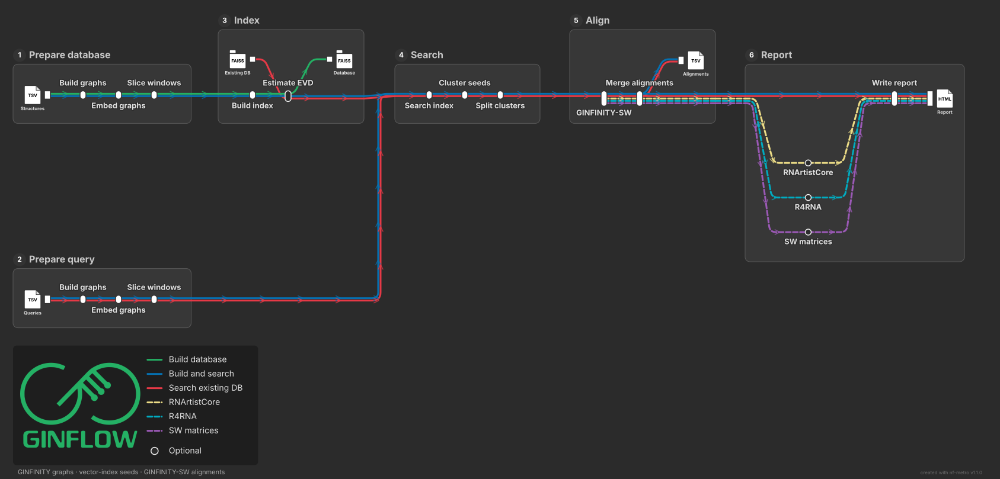

<p align="center">
  
</p>

# GINflow

---

## Introduction

**nicoaira/ginflow** is a Nextflow pipeline for BLAST-style search over RNA secondary structures. It uses [GINFINITY](https://github.com/nicoaira/GINFINITY) to build graph shards and node embeddings, then slices those embeddings into windows and searches them with FAISS, [cuVS](https://docs.nvidia.com/cuvs/) CAGRA / IVF-Flat, or custom-distance [hnswlib](https://github.com/nmslib/hnswlib) / PQ-CAGRA when nodes are product-quantized.

The current steps are:

1. Split a structures TSV into shards
2. Build GINFINITY graph shards (`*.safetensors` + `*.json`)
3. Embed each shard (`*.npz` + manifest)
4. Slice sliding windows (default `w=11`, stride 1)
5. Build a reusable window database and/or search it for seeds. Default is `--index faiss --faiss_index flatip` (exact cosine). Optional `--quantize sq|pq|opq` compresses **nodes** before index windows are formed. GPU graphs use `--index cagra` (stock cuVS CAGRA for none/SQ, custom PQ-CAGRA for PQ/OPQ). `--cagra_to_hnsw true` builds that graph on GPU and searches on CPU. See [docs/indexes.md](docs/indexes.md). `--faiss_gpu` and CAGRA/IVF builds need `-profile gpu`. Exact original-window rerank is on by default (`--exact_rerank true`).
6. Cluster nearby seeds into HSPs, align each crop with GINFINITY-SW, collapse HSPs by query-target pair, and rank by aggregate database E-value
7. Optionally plot structures (`--plot_backend`: RNArtistCore 2Ds and/or a unified R4RNA alignment arc plot) and/or SW matrices (`--plot_sw`)
8. Write a standalone HTML search report (`report.html`)

## Pipeline overview

<p align="center">
  
</p>

One pipeline from embeddings to the HTML report. An existing database joins at Search. Open circles are optional. Quantize and the index backends are on a separate map in [docs/indexes.md](docs/indexes.md).

## Documentation

The full wiki lives in [`docs/`](docs/README.md):

| Section | Contents |
|---|---|
| [Getting started](docs/getting-started.md) | Install Nextflow, smoke test, first search |
| [How it works](docs/how-it-works.md) | Graphs, embeddings, windows, index, SW, E-values |
| [Usage](docs/usage.md) | Structures table, [sliced graphs](docs/usage.md#sliced-graphs), run modes |
| [Window indexes](docs/indexes.md) | FAISS, CAGRA, IVF, hnswlib, `--quantize` |
| [Clustering and alignment](docs/clustering-and-alignment.md) | Seed clustering, GINFINITY-SW, pair collapse |
| [E-values](docs/statistics.md) | Reverse-sequence null, λ, K |
| [Output](docs/output.md) | Directory layout and file formats |
| [Plotting and report](docs/plotting.md) | `report.html`, RNArtistCore, R4RNA, SW matrices |
| [Parameters](docs/parameters.md) | Every CLI flag |
| [Profiles and hardware](docs/profiles.md) | Docker / Singularity / conda / GPU |
| [Development](docs/development.md) | Layout, tests, containers |
| [FAQ](docs/faq.md) | Common errors |

---

## Usage

> [!NOTE]
> If you are new to Nextflow and nf-core, please refer to [this page](https://nf-co.re/docs/get_started/environment_setup/overview) on how to set-up Nextflow. Check your setup with `-profile smoke_test` (10 sequences) or `-profile test` (1200 sequences) before running the workflow on actual data.

Prepare a structures TSV. Three columns are required (`transcript_id`, `sequence`, `secondary_structure`). Extra columns such as `rfam_family` are allowed.

To embed only part of a molecule (a motif, domain, or other interval), add optional `start` and `end` columns. Coordinates are 0-based half-open (`sequence[start:end]`). Empty cells keep the full molecule. Comma-separated lists make several independent subjects from one row:

```tsv
transcript_id	sequence	secondary_structure	rfam_family	start	end
rna-1	ACGUACGUACGUACGU	((....))((....))	RF00005		
rna-2	GGGAAACCCUUUUGGG	......(((....)))	RF00001	9	16
rna-3	…	…	RF00003	34,40	90,95
```

That table yields four subjects: full `rna-1`, `rna-2:9-16`, `rna-3:34-90`, and `rna-3:40-95`. Each is embedded, indexed, and searched on its own. Crossing-pair context is kept by default (`--keep_paired_neighbours`, `--context_hops 4`). Full guide: [Sliced graphs](docs/usage.md#sliced-graphs). A mixed example file is [`tests/data/sliced_structures.tsv`](tests/data/sliced_structures.tsv).

Then:

```bash
# Build a reusable FAISS database
nextflow run nicoaira/ginflow \
   -profile docker \
   --input structures.tsv \
   --outdir <OUTDIR>

# Search an existing database
nextflow run nicoaira/ginflow \
   -profile docker \
   --query queries.tsv \
   --database <OUTDIR>/index \
   --outdir <SEARCH_OUTDIR>

# Build and search in one run
nextflow run nicoaira/ginflow \
   -profile docker \
   --input structures.tsv \
   --query queries.tsv \
   --outdir <OUTDIR>
```

Builds publish the reusable database under `<OUTDIR>/index/`. Raw graph,
embedding, and window shards are not published by default. Add
`--save_graphs true`, `--save_embeddings true`, or `--save_windows true` when
you need those per-shard artifacts; add `--save_quantized_windows true` when
you need the intermediate quantized window shards. Query results are grouped
under `<OUTDIR>/seeds/`.

### Test database + short queries

From a clone of this repo, build the 1200-sequence test database and search it with four molecules shorter than 200 nt, each from a different Rfam family (`tests/data/example_queries.tsv`: RF00001, RF00003, RF01725, RF01852). Those four records are also in the test table, so the top hit for each query should be itself. To try `start` / `end` windows, use `tests/data/sliced_structures.tsv` as `--input` and/or `--query`.

```bash
# Build the test database
nextflow run . \
    -profile docker,test \
    --outdir testdb

# Search it
nextflow run . \
    -profile docker \
    --query tests/data/example_queries.tsv \
    --database testdb/index \
    --outdir test_search
```

Or both steps in one run:

```bash
nextflow run . \
    -profile docker,test \
    --query tests/data/example_queries.tsv \
    --outdir test_search
```

Ranked alignments are in `test_search/alignments.tsv`. Open `test_search/report.html` in a browser for the searchable hit report.

> [!WARNING]
> Please provide pipeline parameters via the CLI or Nextflow `-params-file` option. Custom config files including those provided by the `-c` Nextflow option can be used to provide any configuration _**except for parameters**_; see [docs](https://nf-co.re/docs/running/run-pipelines#using-parameter-files).
