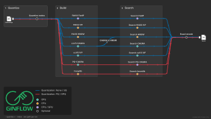

# Window indexes

GINflow searches sliding windows of GINFINITY embeddings. Each window concatenates
`--window_size` consecutive 128-dimensional residue vectors (default 11 → 1408
dimensions). Original residue embeddings are always kept for Smith–Waterman,
alignment, plots, and optional exact rerank.

Two choices control the index:

| Flag | What it selects |
|---|---|
| `--quantize` | How **nodes** are compressed **before** index windows are formed |
| `--index` | Which library builds and searches those windows |

```text
--quantize none|sq     ×  --index faiss|cagra|ivf
--quantize pq|opq      ×  --index cagra|hnswlib
```

`--index cagra` is one user-facing name. With `--quantize none` or `sq` it is
stock cuVS CAGRA over standard-distance windows. With `--quantize pq` or `opq`
it is GINflow’s custom PQ-CAGRA (node codes + ADC). You do not pick the CAGRA
implementation yourself.



## Devices: who can build and who can search

| Index | Quantize | Build | Search | Notes |
|---|---|---|---|---|
| FAISS `flatip` / `flatl2` | none, sq | CPU or GPU (`--faiss_gpu`) | CPU or GPU | Exact. Default. GPU needs `-profile gpu`. |
| FAISS `ivfflat` | none, sq | **CPU only** | **CPU only** | Approximate IVF. GPU IVF is `--index ivf`. |
| FAISS `hnsw` | none, sq | **CPU only** | **CPU only** | FAISS 1.10 has no GPU HNSW. For a GPU graph use `--index cagra`. |
| cuVS IVF-Flat (`--index ivf`) | none, sq | **GPU only** | **GPU only** | `-profile gpu`. |
| CAGRA (`--index cagra`) | none, sq | **GPU only** | GPU, or CPU after `--cagra_to_hnsw` | Stock cuVS graph. |
| CAGRA (`--index cagra`) | pq, opq | **GPU only** | GPU ADC, or CPU ADC of the **same** graph (`--search_device cpu` or `--cagra_to_hnsw`) | Custom distance. Not stock `IndexIVFPQ`. |
| hnswlib (`--index hnswlib`) | pq, opq | **CPU only** | **CPU only** | Custom SDC build, ADC search. Use when **no GPU is available at build time**. |

**GPU CAGRA → CPU HNSW.** Pass `--index cagra --cagra_to_hnsw true` (and
`-profile gpu` for the build). GINflow builds the graph on GPU, writes a
CPU-searchable form, and later searches with `--search_device cpu` even
without a GPU. For uncompressed/SQ this is cuVS CAGRA converted to HNSW. For
PQ/OPQ the serialized custom graph is walked on CPU (not a FAISS HNSW file).

## Compression: `--quantize`

Compression is applied to each 128-d **node**, then windows are sliced from
those compressed nodes. Library product quantizers that treat a 1408-d window
as one vector (`IndexIVFPQ`, cuVS IVF-PQ) are not offered: they split the
window in the wrong places.

| Mode | What is stored per node | Distance | Custom kernel? |
|---|---|---|---|
| `none` (default) | float16 embeddings, float32 at FAISS search | Inner product / L2 | No |
| `sq` | per-dimension int8 affine | Standard IP/L2 after dequant | No |
| `pq` | `M` subcodes (`--pq_m`, `--pq_nbits`) | Graph **build** uses SDC; **search** uses ADC | Yes |
| `opq` | Same codes after a learned 128×128 rotation | Same as PQ; queries are rotated before ADC | Yes |

**ADC vs SDC.** Search is always asymmetric when codes are used: the query
stays in the original 128-d node space, a lookup table is built from the
query and the codebook, and database codes are scored by table lookup (ADC).
Graph construction compares database points to each other, so it uses the
symmetric codebook table (SDC). That table is written next to the codebook
during `QUANTIZE_NODES`; it is not a separate pipeline process. Queries are
not quantized for ADC search.

**OPQ** usually reconstructs nodes more faithfully than plain PQ at the same
`M` and bit width. Prefer `--quantize opq` unless train time is the limit.

Recommended PQ/OPQ layout: `--pq_m 16 --pq_nbits 4`.

## How to choose

Window counts below assume default `--window_size 11` and `--window_stride 1`.
A molecule of length `L` contributes `L - 10` windows, so **1 million windows
is about 5 000 molecules of mean length 210 nt** (5 000 × 200 nt is ~0.95
million windows).

Payload size per window, **before** graph links. FAISS Flat stores float32.
Original `embeddings.npz` (256 B per residue) is extra and always published.

| Representation | Bytes / window | 1M windows | ~4M windows | 10M windows |
|---|---:|---:|---:|---:|
| FAISS Flat float32 | 5 632 | 5.6 GB | 23 GB | 56 GB |
| float16 pack | 2 816 | 2.8 GB | 11 GB | 28 GB |
| SQ int8 | 1 408 | 1.4 GB | 5.6 GB | 14 GB |
| PQ `M=16` 8-bit codes | 176 | 176 MB | 704 MB | 1.8 GB |
| PQ `M=16` 4-bit packed | 88 | 88 MB | 352 MB | 880 MB |

Add graph links: CAGRA degree 32 ≈ 128 B/window; degree 64 or HNSW `M=32` ≈
256 B/window.

1. **Fits in RAM as FAISS FlatIP** (a few million windows on a 32 GB box) →
   `--quantize none --index faiss --faiss_index flatip`. Exact, simplest.
2. **Same data, GPU, faster queries** → `--index cagra`, or `--faiss_gpu true`
   with `flatip` / `flatl2`. GPU IVF is `--index ivf`.
3. **Larger than Flat, still want stock libraries** → `--faiss_index ivfflat`
   (CPU) or `hnsw`, or `--index ivf` (GPU). Add `--quantize sq` if you want a cheaper
   standard-distance representation.
4. **Build on GPU, serve on CPU** → `--index cagra --cagra_to_hnsw true`, then
   query with `--search_device cpu`.
5. **Codes must be tiny (PQ/OPQ)** → `--quantize opq --pq_m 16 --pq_nbits 4`
   and `--index cagra` if a GPU is available at **build** time. Use
   `--index hnswlib` only when the build host has no GPU. Keep
   `--exact_rerank true` and grow `--candidate_k` / `--seed_k` with `n`.

`--candidate_k` (default 200) is the ANN pool; `--seed_k` (default 50) is what
is kept after rerank. Raise both as the database grows, for example `--candidate_k 1000`
around 1M windows and `--candidate_k 5000` around 4M+.

## Shared parameters

### Build

| Parameter | Default | Description |
|---|---:|---|
| `--index` | `faiss` | `faiss`, `cagra`, `ivf`, or `hnswlib`. |
| `--quantize` | `none` | `none`, `sq`, `pq`, `opq`. |
| `--window_size` | `11` | Residues per window. |
| `--window_stride` | `1` | Step between window starts. |
| `--cagra_to_hnsw` | `false` | GPU CAGRA build, then persist a CPU-searchable graph. |
| `-profile gpu` | unset | Required to **build** CAGRA/IVF and to use `--faiss_gpu`. |

### Search

| Parameter | Default | Description |
|---|---:|---|
| `--seed_k` | `50` | Seeds kept per query window after rerank/threshold. Increase with DB size. |
| `--candidate_k` | `200` | ANN candidates before rerank. Must be ≥ `--seed_k`. Increase with DB size. |
| `--seed_min_similarity` | `0.8` | Cosine-like threshold on **original-window** scores after rerank. |
| `--search_device` | `auto` | `gpu`, `cpu`, or `auto` for CAGRA. |
| `--search_shard_size` | `--shard_size` | Query records per search task. |
| `--exact_rerank` | `true` | Exact original-window rerank. Skipped for exact FlatIP/FlatL2. |
| `--exact_rerank_device` | `cpu` | `cpu` or `cuda` (`cuda` needs `-profile gpu`). |

## FAISS: `--index faiss`

Pinned FAISS 1.10. The on-disk `index.faiss` is always a CPU index;
`--faiss_gpu` uses the GPU only inside the task, and only for exact Flat.

| `--faiss_index` | Exact? | GPU | Typical use |
|---|---:|---:|---|
| `flatip` (default) | Yes | Yes | Exact cosine on L2-normalized windows. |
| `flatl2` | Yes | Yes | Exact L2, converted to a cosine-like seed score. |
| `ivfflat` | No | **No** | CPU IVF. GPU IVF is `--index ivf`. |
| `hnsw` | No | **No** | High-recall CPU graph. GPU graph → `--index cagra`. |

`--faiss_nlist` / `--faiss_nprobe` apply to `ivfflat` (auto from `n` when unset).
`--faiss_hnsw_m` (32), `--faiss_hnsw_ef_construction` (200),
`--faiss_hnsw_ef_search` (64) apply to `hnsw`.

## CAGRA: `--index cagra`

**Uncompressed / SQ.** Stock cuVS CAGRA, metric cosine. Build always needs a
GPU. Search is GPU unless you converted with `--cagra_to_hnsw`.

| Parameter | Default | Role |
|---|---:|---|
| `--cagra_intermediate_graph_degree` | `128` | Neighbours before prune. |
| `--cagra_graph_degree` | `64` | Neighbours retained. |
| `--cagra_build_algo` | `nn_descent` | cuVS builder (`nn_descent`, `ivf_pq`, `iterative_cagra_search`, `ace`). |
| `--cagra_itopk_size` | `64` | Intermediate beam; raised to at least `--candidate_k`. |

**PQ / OPQ.** Same `--index cagra`, automatically the custom kernel: node
codes, SDC graph build, ADC search with the LUT in GPU shared memory (or the
CPU walker). Recommended graph for the compact 4-bit layout:
`--cagra_graph_degree 32 --cagra_intermediate_graph_degree 64 --cagra_nndescent_iterations 6`.

## IVF-Flat: `--index ivf`

cuVS IVF-Flat. GPU build and GPU search. `--cuvs_n_lists` and `--cuvs_n_probes`
default from `n`. Standard distance only (`none` or `sq`). This is the GPU IVF
path; FAISS `--faiss_index ivfflat` is CPU-only.

## hnswlib: `--index hnswlib`

CPU custom-distance HNSW over PQ/OPQ **code windows**. Build uses SDC; search
uses ADC on original query windows. Requires a C++ compiler in the task image.

CAGRA graphs built for the same codes usually outperform this path and can be
searched on CPU after `--cagra_to_hnsw`. Use hnswlib when the **build** machine
has no GPU.

| Parameter | Default |
|---|---:|
| `--hnswlib_m` | `32` |
| `--hnswlib_ef_construction` | `200` |
| `--hnswlib_ef_search` | `200` |

## Exact rerank

`--exact_rerank true` (default) is a separate process. The index may return
`--candidate_k` labels; the reranker scores those labels with original
normalized windows and writes `--seed_k` seeds. Quantized codes are never the
SW input.

It is skipped when the index is already exact (`flatip` / `flatl2`). Set
`--exact_rerank false` (or `--exact_rerank=false`) to emit ANN scores only
(not recommended for PQ/OPQ).

## Published database

Under `results/faiss/` (the directory name is historical):

| Artifact | When |
|---|---|
| `index.faiss` | FAISS |
| `cuvs/` | stock CAGRA or IVF-Flat |
| `hnsw/` | converted CPU HNSW from uncompressed/SQ CAGRA |
| `cagra.index` | PQ-CAGRA graph |
| `index.bin` | hnswlib PQ graph |
| `quantization/` | codebook, SDC table, OPQ rotation, SQ scales, node codes |
| `windows.tsv`, `meta.json` | window map and resolved parameters |
| `embeddings.npz`, `records.tsv` | original residues for SW / rerank / alignment |

`--database` is that directory. On query-only runs GINflow reads `meta.json`.
An explicit `--index` that disagrees with the database is an error.

## Software (`-profile docker` / `-profile conda`)

Every index process ships a pinned Conda environment and a Wave-frozen
container. `-profile docker` and `-profile conda` need **no extra local
installs** (no `pip`, no local CUDA toolkit, no source build).

Custom PQ-CAGRA code is published on Anaconda as:

| Package | Channel | Used by |
|---|---|---|
| `pq-cagra-adc` | `nicolas.aira` | GPU build (`BUILD_PQ_CAGRA_INDEX`) and GPU ADC search |
| `pq-cagra-adc-cpu` | `nicolas.aira` | CPU ADC search (`--search_device cpu` / `--cagra_to_hnsw`) |

The conda profile already lists `nicolas.aira`. GPU CAGRA/IVF/FAISS still
need `-profile gpu` so the NVIDIA runtime is attached.

## See also

- [How it works](how-it-works.md)
- [Parameters](parameters.md)
- [Profiles and hardware](profiles.md)
- [FAQ](faq.md)
